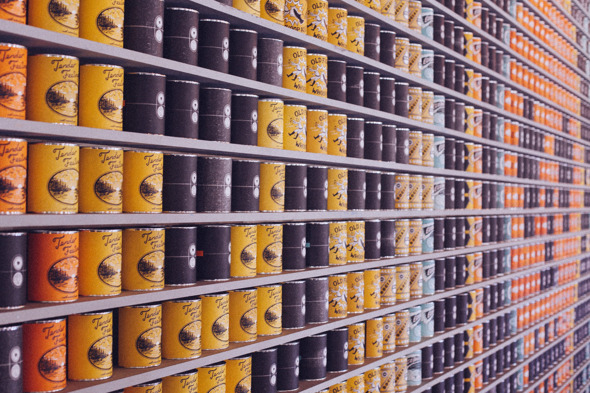

#[fit] RxDownloader

@Reyurnible

---


## Topic

- DownManager
- RxJava
- Kotlin

---


## DownloaderManager知ってますか？

---


- Kindle
- PlayStore

などに使われてる、Androidの大きなファイルダウンロードする時に使うやつ！

---

### DownloadManagerを普通に使う場合

```java
final Uri uri = Uri.parse("URI");
final DownloadManager.Request request = new DownloadManager.Request(uri);
request.setTitle("Sample Download");
request.setDescription("sample of using download manager");
// and so your reuest settings...
final DownloadManager manager = (DownloadManager) getSystemService(Context.DOWNLOAD_SERVICE);
manager.enqueue(mRequest);
```

---

### DownloadManagerでイベントを取得するには

```java
final DownloadManager.Request request = new DownloadManager.Request(uri);
// and so your reuest settings...
final DownloadManager manager = (DownloadManager) getSystemService(Context.DOWNLOAD_SERVICE);
BroadcastReceiver receiver = new BroadcastReceiver() {
  @Override
  public void onReceive(Context context, Intent intent) {
    if (DownloadManager.ACTION_DOWNLOAD_COMPLETE.equals(intent.getAction())) {
      final long id = intent.getLongExtra(DownloadManager.EXTRA_DOWNLOAD_ID, -1);
      final DownloadManager.Query query = new DownloadManager.Query();
      query.setFilterById(id);
      final Cursor cursor = manager.query(query);
      cursor.moveToFirst();

      final int status = cursor.getColumnIndex(DownloadManager.COLUMN_STATUS);
      /** handling status **/
    }
  }
};
this.registerReceiver(receiver, new IntentFilter(DownloadManager.ACTION_DOWNLOAD_COMPLETE));
manager.enqueue(request);
```

---


## イベントの受け取り方がイケてない

- Receiverイベントを受けたくない場合
- ダウンロードしたファイルの取得などのコードを書きたくない
- 連続でダウンロードしたときの取得完了を感知したい

---


# Solution

---


## RxJava
利点：

- インターフェースを揃えられる
- 複数のイベントを、複数回発行するのにいい


---


## 作りました：RxDownloader

---

## Step1

RxDownloaderのインスタンスを作成する

```java
final DownloadManager.Request request = new DownloadManager.Request(uri);
request.setTitle("Sample Download");
request.setDescription("sample of using download manager");
// and so your reuest settings...

// Create Request list
ArrayList<DownloadManager.Request> requests = new ArrayList<>();
requests.add(request);
/* === Step1 Create rxdownload === */
RxDownloader rxDownloader = new RxDownloader(this, requests);
```

---

## Step2

```java
/* === Step2 Execute === */
rxDownloader.execute()
  .subscribe(new Subscriber<RxDownloader.DownloadStatus>() {
      @Override
      public void onNext(RxDownloader.DownloadStatus downloadStatus) {
        //　各Downloadの終了が、ダウンロード結果と一緒に通知
      }
      @Override
      public void onCompleted() {
        // 全てのダウンロードが完了したら通知
      }
      @Override
      public void onError(Throwable e) {
        //　ダウンロードエラーなどが発生した際に通知
      }
    });
```

---

## Kotlin

```Kotlin
val request = DownloadManager.Request(uri).apply {
  setTitle("Sample Download")
  setDescription("sample of using download manager")
  // and so your reuest settings...
}
request.execute(this)
  .subscribe({ status ->
    // Handling status event
  }, { error ->
    // Error action
  }, {
    // Complete all request
  })
```

---

## DownloadStatusの中身

```Kotlin
sealed class DownloadStatus(val result: RequestResult) {
  class Successful(result: RequestResult) : DownloadStatus(result)
  class Running(result: RequestResult) : DownloadStatus(result)
  class Pending(result: RequestResult) : DownloadStatus(result)
  class Paused(result: RequestResult, val reason: String) : DownloadStatus(result)
  class Failed(result: RequestResult, val reason: String) : DownloadStatus(result)
}

data class RequestResult(
  val id: Long,
  val remoteUri: String,
  val localUri: String,
  val mediaType: String,
  val totalSize: Int,
  val title: String?,
  val description: String?
)
```

---


## Code

[https://github.com/Reyurnible/RxDownloader](https://github.com/Reyurnible/RxDownloader)

---


## LINK

懇親会で気軽に話しかけてください。
